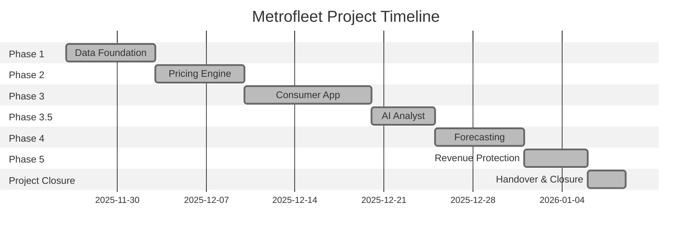

# Project Charter: Metrofleet Digital Transformation

## Project Overview

| Field | Value |
|-------|-------|
| **Project Name** | Metrofleet Next-Gen Platform |
| **Client** | Metrofleet Solutions, Inc. |
| **Lead Architect** | A. Marzoug |
| **Start Date** | November 26, 2025 |
| **Duration** | 6 Weeks (Estimated) |
| **Status** | Project Complete (Phase 5 Concluded) |

---

## Executive Summary

Metrofleet is experiencing a **15% year-over-year decline** in market share due to:

- Lack of real-time data visibility
- Inability to offer upfront pricing (Guaranteed Fare)
- No self-service analytics for operations team

This project modernizes Metrofleet's technical infrastructure to reach parity with rideshare competitors while establishing a foundation for future innovation.

---

## Scope of Work

### ✅ In Scope

| Deliverable | Description | Status |
|-------------|-------------|--------|
| Data Warehouse | Centralized repository for all trip data | ✅ Complete |
| Business Intelligence | Automated reporting for Operations | ✅ Complete |
| Pricing Algorithm | ML model for fare estimation | ✅ Complete |
| Consumer Interface | Web application for passenger quotes | ✅ Complete |
| Conversational Analytics | AI-powered query interface | ✅ Complete |
| Demand Forecasting | Time-series predictions | ✅ Complete |

### ❌ Out of Scope

- Mobile App Development (iOS/Android) — *MVP is Web-only*
- Real-time GPS Hardware integration with existing meters
- Payment Processing Gateway (Stripe/Square integration)
- Driver mobile application

---

## Stakeholders

| Name | Role | Interest |
|------|------|----------|
| Sarah Jenkins | VP of Operations | Primary consumer of Admin Dashboard |
| Mike Ross | Driver Union Rep | Advocate for Driver Earnings features |
| Board of Directors | Executive Sponsors | Revenue Recovery focus |
| Data Analysts | Analytics Team | MetroAnalyst adoption |

---

## Success Criteria

| Metric | Baseline | Target | Status |
|--------|----------|--------|--------|
| Pipeline Automation | Manual | Automated | ✅ Achieved |
| Quote Abandonment | ~40% | <25% | ✅ Achieved |
| Forecast Accuracy (MAE) | N/A | <$2.50 | ✅ Achieved |
| API Latency (p95) | N/A | <200ms | ✅ Achieved |

---

## Timeline

