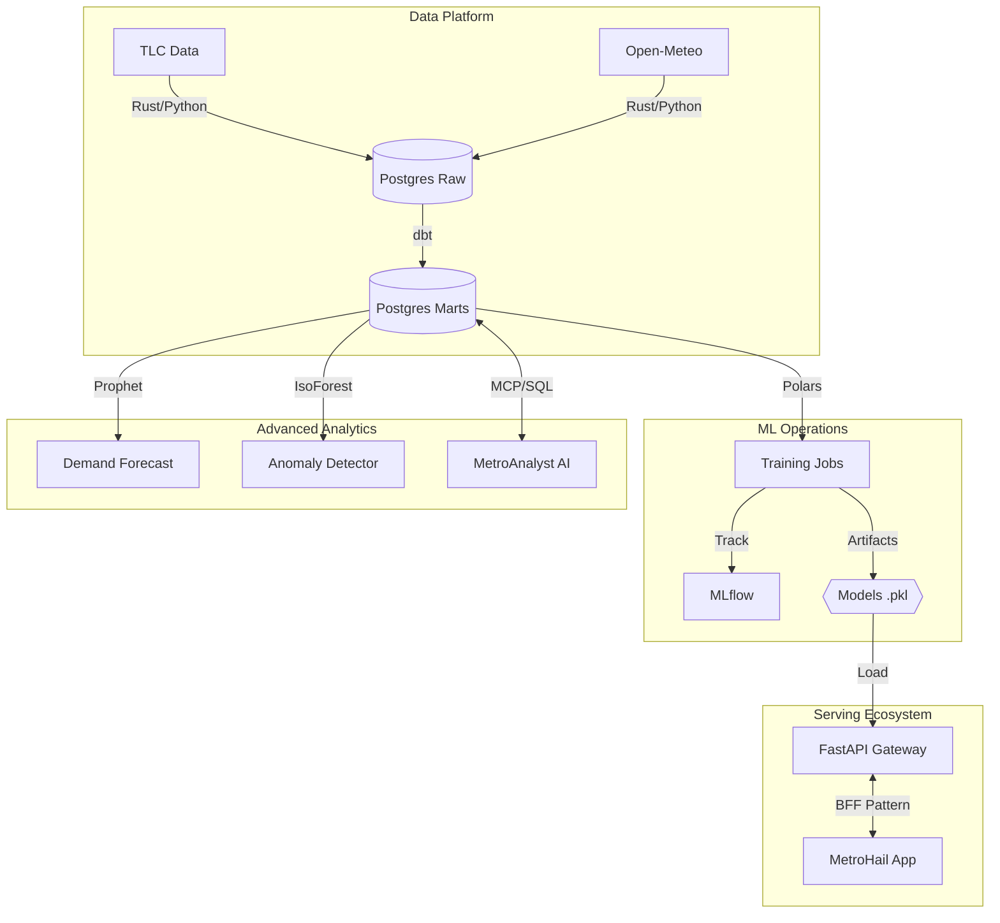
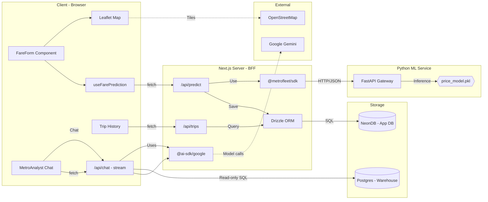

# Metrofleet Platform Architecture

## System Overview

The Metrofleet platform implements a **Lakehouse architecture** extended with **MLOps** capabilities and **Microservices** for real-time prediction and conversational analytics.

---

## High-Level Data Flow

---

## Serving Architecture

---

## Component Details

### 1. Ingestion Layer (Rust + Python)

| Aspect | Details |
|--------|---------|
| **Tool** | Custom Rust CLI (`tlc-cli`) wrapped in Python Dagster Assets |
| **Why Rust?** | High-concurrency downloads, memory safety for large Parquet files (GBs) |
| **Why Dagster?** | Asset-based orchestration with data dependencies and monthly partitioning |
| **Data Sources** | NYC TLC (trips), Open-Meteo (weather), Python Holidays lib |

### 2. Data Warehouse (PostgreSQL 15)

| Aspect | Details |
|--------|---------|
| **Container** | Dockerized PostgreSQL 15 |
| **Role** | Serves as both "Data Lake" (Raw) and "Data Warehouse" (Transformed) |
| **Pattern** | "Delete-Write" for idempotent loads |
| **Schemas** | `raw` (ingestion), `dbt_dev` (transformations) |

### 3. Transformation Layer (dbt)

| Aspect | Details |
|--------|---------|
| **Pattern** | Staging → Core → Marts |
| **Key Logic** | Filters negative fares, joins with Taxi Zone Lookups, aggregates daily revenue |
| **Output Tables** | `fct_trips`, `dm_daily_revenue` |

### 4. Presentation Layer (Streamlit)

| Aspect | Details |
|--------|---------|
| **Role** | Real-time operational visibility for stakeholders |
| **Latency** | Data refreshed on daily cadence via pipeline |
| **Features** | Revenue analytics, borough breakdown, trend visualization, forecasting |

### 5. MLOps Layer (MLflow + Dagster)

| Aspect | Details |
|--------|---------|
| **Tracking** | MLflow 3.x backed by Postgres |
| **Server** | Runs via Gunicorn for production traffic |
| **Artifacts** | Models saved to shared Docker Volume (`/data/models`) |
| **Features** | Weather enrichment, holiday impact, zone-based pricing |

### 6. Prediction API (FastAPI)

| Aspect | Details |
|--------|---------|
| **Pattern** | Microservice |
| **Role** | Loads `.pkl` artifact into memory on startup |
| **Validation** | Pydantic for input features (Zone IDs, Datetime) |
| **Features** | Real-time feature engineering (Hour/Day extraction) |

### 7. MetroHail App (Next.js)

| Aspect | Details |
|--------|---------|
| **Framework** | Next.js 15+ (App Router) |
| **Mapping** | Leaflet.js (Client-side) with OpenStreetMap tiles |
| **API Routes** | `/api/predict` (SDK + ORM), `/api/trips` (history) |
| **Database** | NeonDB (Postgres) for OLTP (Trip History, Users) |
| **SDK** | `@metrofleet/sdk` for type-safe API communication |

### 8. MetroAnalyst (Conversational Analytics)

| Aspect | Details |
|--------|---------|
| **Framework** | Next.js (App Router) — `apps/analyst` |
| **Role** | Conversational interface for ad-hoc analytics |
| **AI Provider** | `@ai-sdk/google` (Gemini) with streaming responses |
| **Safety** | Read-only SQL enforcement, result truncation (50 rows max) |
| **Data Access** | Queries `dbt_dev` tables (`fct_trips`, `dm_daily_revenue`) |

### 9. Demand Forecasting Engine

| Aspect | Details |
|--------|---------|
| **Algorithm** | Meta Prophet |
| **Strategy** | Multi-model approach (1 model per Borough) |
| **Output** | `demand_forecasts` table (7-day horizon), visualized in the Admin Dashboard |

### 10. Anomaly Watchdog

| Aspect | Details |
|--------|---------|
| **Algorithm** | Isolation Forest (Unsupervised) |
| **Role** | Scans `fct_trips` nightly for outliers in Price/Distance ratios |
| **Output** | `compliance_flags` table for manual review |

### 11. MetroAnalyst (AI Agent)

| Aspect | Details |
|--------|---------|
| **Stack** | Next.js 15 + Vercel AI SDK + Google Gemini 3 |
| **Architecture** | RAG (Retrieval Augmented Generation) with **Generative UI** |
| **Capabilities** | Can write SQL, execute it against the Warehouse, and render results in the chat stream |

---

## Service Endpoints

| Service | Port | URL |
|---------|------|-----|
| Dagster UI | 3000 | <http://localhost:3000> |
| Streamlit Dashboard | 8501 | <http://localhost:8501> |
| MetroHail (Consumer App) | 3001 | <http://localhost:3001> |
| MetroAnalyst | 3002 | <http://localhost:3002> |
| Prediction API | 8000 | <http://localhost:8000> |
| MLflow UI | 5000 | <http://localhost:5000> |
| PostgreSQL | 5432 | localhost:5432 |
| JupyterLab | 8888 | <http://localhost:8888> |
